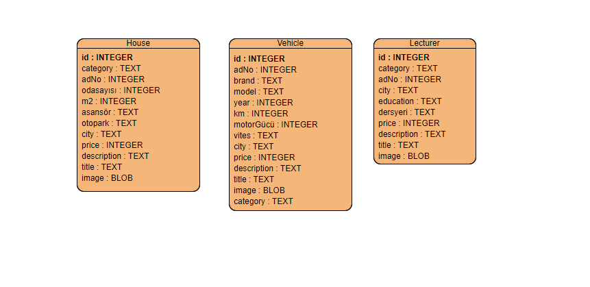

# Sahibinden Web Application

This web application allows users to view and search for classified ads in different categories, such as vehicles, houses, and lectures. Users can also view detailed information about specific ads.

## Features

- View a summary of the number of ads in each category.
- Search for ads based on specific attributes.
- View detailed information about individual ads.

## Usage

- Access the home page to view all of ads in different categories.
- Use the search bar to search for ads based on specific attributes.
- Click on an ad to view detailed information.

## File Structure

- `app/`: Contains the Flask application code.
    - `routes.py`: Defines the routes and logic for handling requests.
- `static/`: Contains static files such as CSS stylesheets and images.
- `templates/`: Contains HTML templates for rendering pages.
- `table.sqlite`: SQLite database file containing ad data.

## Database Schema

- The database contains three tables: `VEHICLE`, `HOUSE`, and `LECTURER`.
- Each table has columns representing different attributes of ads in the respective categories.

## ER-Diagram

## Dependencies

- Flask: Web framework for Python.
- SQLite: Lightweight relational database management system.
- Base64: Module for encoding and decoding binary data.

## Azure Deployment

- **Deployed At**: [Deployment Adress](https://assignment2flaskwebapp.azurewebsites.net/)